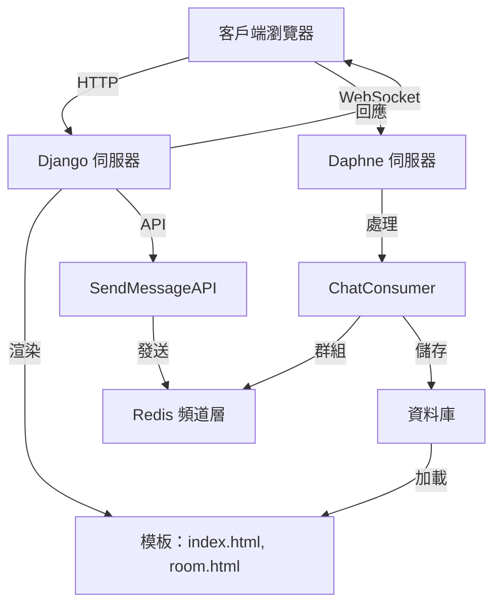

# 即時聊天應用程式

這是一個基於 **Django** 和 **Django Channels** 構建的即時聊天應用程式，支援多個聊天室並使用 WebSocket 傳遞消息。專案包含 REST API 和消息持久化功能，適合本地開發與測試。

## 功能
- 即時消息傳遞（WebSocket 支援）。
- 聊天記錄持久化（預設 SQLite）。
- REST API 供外部發送消息（需認證）。
- 簡單的前端介面（HTML/JavaScript）。
- 環境變數配置（使用 `python-decouple`）。

## 架構圖



**說明**：
- **客戶端瀏覽器**：通過 `index.html` 選擇聊天室，`room.html` 進行聊天。
- **Django 伺服器**：處理 HTTP 請求並渲染頁面。
- **Daphne 伺服器**：管理 WebSocket 連線。
- **ChatConsumer**：處理即時消息。
- **Redis 頻道層**：支援群組消息。
- **資料庫**：儲存聊天記錄。
- **SendMessageAPI**：提供 REST API 功能。

## 環境要求
- Python 3.10+
- Redis（運行在 `127.0.0.1:6379`）
- Git

## 安裝與運行

1. **克隆倉庫**：
   ```bash
   git clone https://github.com/BpsEason/realtime_chat_project.git
   cd realtime_chat_project
   ```

2. **建立虛擬環境**：
   ```bash
   python3 -m venv .venv
   source .venv/bin/activate  # Windows: .venv\Scripts\activate
   ```

3. **安裝依賴**：
   ```bash
   pip install -r requirements.txt
   ```

4. **啟動 Redis**：
   - Ubuntu/Debian：`sudo apt install redis-server`
   - macOS：`brew install redis && brew services start redis`
   - 檢查：`redis-cli ping`（應返回 `PONG`）

5. **配置環境變數**：
   建立 `.env` 檔案：
   ```ini
   SECRET_KEY=your-secure-key-here
   DEBUG=True
   ALLOWED_HOSTS=127.0.0.1,localhost
   REDIS_URL=redis://127.0.0.1:6379
   ```
   生成 `SECRET_KEY`：
   ```bash
   python -c 'from django.core.management.utils import get_random_secret_key; print(get_random_secret_key())'
   ```

6. **遷移資料庫**：
   ```bash
   python manage.py migrate
   ```

7. **建立超級用戶（可選）**：
   ```bash
   python manage.py createsuperuser
   ```

8. **啟動伺服器**：
   - 終端機 1（WebSocket）：
     ```bash
     daphne -b 0.0.0.0 -p 8000 realtime_chat_project.asgi:application
     ```
   - 終端機 2（HTTP）：
     ```bash
     python manage.py runserver 0.0.0.0:8001
     ```

9. **訪問應用程式**：
   - 打開：`http://127.0.0.1:8001/chat/`
   - WebSocket：`ws://127.0.0.1:8000/ws/chat/<room_name>/`

## 關鍵代碼片段

### 1. WebSocket Consumer (`chat/consumers.py`)
```python
class ChatConsumer(AsyncWebsocketConsumer):
    async def connect(self):
        self.room_name = self.scope['url_route']['kwargs']['room_name']
        self.room_group_name = f'chat_{self.room_name}'
        await self.channel_layer.group_add(self.room_group_name, self.channel_name)
        self.user = self.scope['user']
        username = self.user.username if self.user.is_authenticated else "未登入用戶"
        await self.accept()

    async def receive(self, text_data):
        text_data_json = json.loads(text_data)
        message = text_data_json['message']
        username = self.user.username if self.user.is_authenticated else "未登入用戶"
        current_timestamp = timezone.now()
        if self.user.is_authenticated:
            ChatMessage.objects.create(room_name=self.room_name, sender=self.user, content=message, timestamp=current_timestamp)
        else:
            ChatMessage.objects.create(room_name=self.room_name, content=message, timestamp=current_timestamp)
        await self.channel_layer.group_send(
            self.room_group_name,
            {'type': 'chat_message', 'message': message, 'user': username, 'timestamp': current_timestamp.isoformat()}
        )
```

### 2. REST API (`chat/views.py`)
```python
class SendMessageAPI(APIView):
    permission_classes = [IsAuthenticated]
    def post(self, request, room_name):
        message = request.data.get('message')
        if not message or not message.strip():
            return Response({"error": "消息內容不可為空"}, status=400)
        current_timestamp = timezone.now()
        ChatMessage.objects.create(room_name=room_name, sender=request.user, content=message, timestamp=current_timestamp)
        channel_layer = get_channel_layer()
        async_to_sync(channel_layer.group_send)(
            f'chat_{room_name}',
            {'type': 'chat_message', 'message': message, 'user': request.user.username, 'timestamp': current_timestamp.isoformat()}
        )
        return Response({"status": "成功"}, status=200)
```

### 3. 前端 WebSocket (`chat/templates/chat/room.html`)
```javascript
var wsUrl = 'ws://' + window.location.host + '/ws/chat/' + encodeURIComponent(roomName) + '/';
var webSocket = new WebSocket(wsUrl);
webSocket.onmessage = function(e) {
    var data = JSON.parse(e.data);
    appendMessage(data.user, data.message, data.timestamp);
};
webSocket.onclose = function(e) {
    setTimeout(function() { new WebSocket(wsUrl); }, 1000);
};
```

## 常見問題 (FAQ)

### 1. 為什麼無法發送消息？
- **原因**：需登入才能發送消息。
- **解決**：運行 `python manage.py createsuperuser` 建立用戶，登入後測試。

### 2. WebSocket 連線失敗？
- **原因**：Daphne 或 Redis 未運行。
- **解決**：確保 `daphne` 啟動，檢查 Redis 狀態 (`redis-cli ping`)。

### 3. 房間名稱無效？
- **原因**：僅允許字母、數字或底線。
- **解決**：使用如 `room1` 或 `chat_123`。

### 4. 部署到生產環境？
- 使用 PostgreSQL，配置 Nginx 和 SSL，運行 `gunicorn`：
  ```bash
  pip install gunicorn
  gunicorn --worker-class=uvicorn.workers.UvicornWorker realtime_chat_project.asgi:application
  ```

## 貢獻
1. Fork 倉庫。
2. 建立分支：`git checkout -b feature/name`。
3. 提交：`git commit -m "描述"`。
4. 推送：`git push origin feature/name`。
5. 提交 PR。

