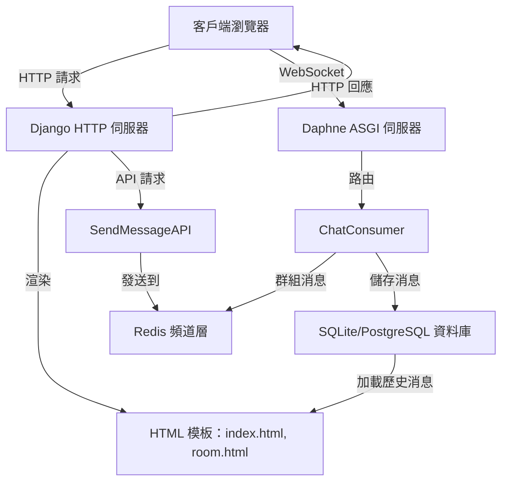

# 即時聊天應用程式

這是一個基於 **Django**、**Django Channels** 和 **Redis** 構建的**即時聊天應用程式**，支援多個聊天室並使用 WebSocket 實現即時消息傳遞。專案包含 REST API，允許外部程式發送消息，並將聊天記錄持久化儲存到資料庫中。本倉庫包含核心代碼，適合本地開發與測試。

## 功能
- **即時消息**：用戶可加入聊天室，通過 WebSocket 即時發送和接收消息。
- **消息持久化**：聊天消息儲存到資料庫（預設使用 SQLite，支援 PostgreSQL）。
- **REST API**：支援外部應用程式通過 HTTP 發送消息（僅限認證用戶）。
- **響應式前端**：簡潔的 HTML/CSS/JavaScript 介面，支援 WebSocket 自動重連。
- **認證管理**：API 和 WebSocket 發送消息需用戶登入（匿名用戶可查看）。
- **環境變數管理**：使用 `python-decouple` 安全管理敏感配置。

## 架構圖

以下是應用程式的架構圖：



**說明**：
- **客戶端瀏覽器**：用戶通過網頁介面（`index.html` 選擇聊天室，`room.html` 進行聊天）進行交互。
- **Django HTTP 伺服器**：處理 HTTP 請求（例如渲染模板、REST API）。
- **Daphne ASGI 伺服器**：管理 WebSocket 連線，實現即時消息。
- **ChatConsumer**：處理 WebSocket 消息並廣播到聊天室群組。
- **Redis 頻道層**：支援 WebSocket 客戶端之間的群組消息傳遞。
- **資料庫**：儲存聊天歷史記錄，支援消息持久化與查詢。
- **SendMessageAPI**：允許外部系統通過 HTTP 向聊天室發送消息。

## 環境要求
- **Python 3.10+**（本地運行環境）。
- **Redis**（確保運行在 `127.0.0.1:6379`）。
- **Git**（用於克隆倉庫）。

## 安裝與運行

### 本地開發環境設置

1. **克隆倉庫**：
   ```bash
   git clone https://github.com/BpsEason/realtime_chat_project.git
   cd realtime_chat_project
   ```

2. **建立並啟用虛擬環境**：
   ```bash
   python3 -m venv .venv
   source .venv/bin/activate  # Windows 使用：.venv\Scripts\activate
   ```

3. **安裝依賴**：
   ```bash
   pip install -r requirements.txt
   ```

4. **安裝並啟動 Redis**：
   - **Ubuntu/Debian**：
     ```bash
     sudo apt update && sudo apt install redis-server
     ```
   - **macOS (Homebrew)**：
     ```bash
     brew install redis && brew services start redis
     ```
   - **Windows**：建議使用 WSL2 或安裝適用於 Windows 的 Redis 版本。
   確保 Redis 運行在 `127.0.0.1:6379`。你可以用以下命令檢查：
   ```bash
   redis-cli ping
   ```
   如果返回 `PONG`，表示 Redis 正在運行。

5. **建立 `.env` 檔案**：
   在 `realtime_chat_project/` 目錄中建立一個名為 `.env` 的檔案，內容如下：
   ```ini
   SECRET_KEY='你的安全密鑰，至少50個隨機字符'
   DEBUG=True
   ALLOWED_HOSTS=127.0.0.1,localhost
   REDIS_URL=redis://127.0.0.1:6379
   ```
   使用以下命令生成安全的 `SECRET_KEY`：
   ```bash
   python -c 'from django.core.management.utils import get_random_secret_key; print(get_random_secret_key())'
   ```
   **注意**：在 Windows（PowerShell）中，使用雙引號：
   ```bash
   python -c "from django.core.management.utils import get_random_secret_key; print(get_random_secret_key())"
   ```

6. **執行資料庫遷移**：
   ```bash
   python manage.py migrate
   ```

7. **建立超級用戶（可選）**：
   用於訪問 Django 管理後台（`http://127.0.0.1:8001/admin/`）：
   ```bash
   python manage.py createsuperuser
   ```

8. **啟動 ASGI 伺服器（Daphne）**：
   在終端機中運行：
   ```bash
   daphne -b 0.0.0.0 -p 8000 realtime_chat_project.asgi:application
   ```
   這將處理 WebSocket 連線。

9. **啟動 Django 開發伺服器**：
   在另一個終端機中，啟用虛擬環境後運行：
   ```bash
   python manage.py runserver 0.0.0.0:8001
   ```
   這將處理 HTTP 請求（例如渲染頁面和 API）。

10. **訪問應用程式**：
    - 在瀏覽器中打開：`http://127.0.0.1:8001/chat/`
    - WebSocket 會自動連接到：`ws://127.0.0.1:8000/ws/chat/<room_name>/`

### 注意事項
- 確保端口 `8000`（Daphne）和 `8001`（Django 開發伺服器）未被占用。若有衝突，可檢查並終止占用進程：
  ```bash
  lsof -i :8000
  kill -9 <PID>
  ```
- 如果 Redis 連線失敗，檢查 `REDIS_URL` 配置和 Redis 服務狀態。

## 關鍵代碼片段（含註解）

### 1. WebSocket Consumer (`chat/consumers.py`)

```python
# 處理 WebSocket 連線，實現即時聊天功能
class ChatConsumer(AsyncWebsocketConsumer):
    async def connect(self):
        self.room_name = self.scope['url_route']['kwargs']['room_name']
        self.room_group_name = f'chat_{self.room_name}'
        # 將客戶端加入聊天室群組，以便廣播消息
        await self.channel_layer.group_add(
            self.room_group_name,
            self.channel_name
        )
        self.user = self.scope['user']
        username = await sync_to_async(lambda: self.user.username)() if self.user.is_authenticated else "未登入用戶"
        logger.info(f"用戶 '{username}' 連線到房間: {self.room_name}")
        await self.accept()

    async def receive(self, text_data):
        try:
            text_data_json = json.loads(text_data)
            message = text_data_json.get('message')
            # 驗證房間名稱格式，防止無效輸入
            valid_room_pattern = re.compile(r'^[a-zA-Z0-9_]+$')
            if not valid_room_pattern.match(self.room_name):
                logger.warning(f"Consumer: 檢測到無效房間名稱格式: {self.room_name}")
                await self.send(text_data=json.dumps({"error": "房間名稱格式無效。"}))
                return
            # 驗證消息內容
            if not message or not isinstance(message, str) or not message.strip():
                logger.warning("收到空消息或無效消息。")
                await self.send(text_data=json.dumps({"error": "消息內容為空或格式無效。"}))
                return
            username = await sync_to_async(lambda: self.user.username)() if self.user.is_authenticated else "未登入用戶"
            current_timestamp = timezone.now()
            # 將消息儲存到資料庫
            if self.user.is_authenticated:
                await sync_to_async(ChatMessage.objects.create)(
                    room_name=self.room_name,
                    sender=self.user,
                    content=message,
                    timestamp=current_timestamp
                )
            else:
                await sync_to_async(ChatMessage.objects.create)(
                    room_name=self.room_name,
                    content=message,
                    timestamp=current_timestamp
                )
            # 將消息廣播到聊天室群組
            await self.channel_layer.group_send(
                self.room_group_name,
                {
                    'type': 'chat_message',
                    'message': message,
                    'user': username,
                    'timestamp': current_timestamp.isoformat(),
                }
            )
        except json.JSONDecodeError:
            logger.error("收到非 JSON 格式的數據。")
            await self.send(text_data=json.dumps({"error": "無效的 JSON 格式。"}))
```

**重點**：
- 使用正則表達式（`^[a-zA-Z0-9_]+$`）驗證房間名稱，確保安全性。
- 支援認證和匿名用戶的消息持久化（儲存到 `ChatMessage` 模型）。
- 使用 Django 的時區感知時間戳（`timezone.now()`）。
- 記錄錯誤和事件，方便調試。

### 2. REST API 視圖 (`chat/views.py`)

```python
class SendMessageAPI(APIView):
    permission_classes = [IsAuthenticated]  # 要求認證
    def post(self, request, room_name, *args, **kwargs):
        # 驗證房間名稱
        valid_room_pattern = re.compile(r'^[a-zA-Z0-9_]+$')
        if not valid_room_pattern.match(room_name):
            logger.warning(f"API: 檢測到無效房間名稱格式: {room_name}")
            return Response({"error": "房間名稱格式無效。"}, status=status.HTTP_400_BAD_REQUEST)
        message_content = request.data.get('message')
        if not message_content or not isinstance(message_content, str) or not message_content.strip():
            logger.warning("API 收到空消息或無效消息。")
            return Response({"error": "消息內容為必填項且不能為空。"}, status=status.HTTP_400_BAD_REQUEST)
        channel_layer = get_channel_layer()
        room_group_name = f'chat_{room_name}'
        user_display_name = request.user.username
        current_timestamp = timezone.now()
        # 儲存到資料庫
        try:
            ChatMessage.objects.create(
                room_name=room_name,
                sender=request.user,
                content=message_content,
                timestamp=current_timestamp
            )
            logger.debug(f"API 發送消息 '{message_content}' 已儲存到資料庫。")
        except Exception as e:
            logger.error(f"API 保存消息到數據庫時發生錯誤: {e}")
        # 發送到 WebSocket 頻道
        async_to_sync(channel_layer.group_send)(
            room_group_name,
            {
                'type': 'chat_message',
                'message': message_content,
                'user': user_display_name,
                'timestamp': current_timestamp.isoformat(),
            }
        )
        return Response({"status": "消息已成功發送到 WebSocket 頻道。"}, status=status.HTTP_200_OK)
```

**重點**：
- 要求認證（`IsAuthenticated`），確保 API 安全性。
- 驗證房間名稱和消息內容。
- 將消息儲存到資料庫並通過 Redis 廣播。
- 提供錯誤日誌和處理。

### 3. 前端 WebSocket 處理 (`chat/templates/chat/room.html`)

```javascript
var wsUrl = (window.location.protocol === 'https:' ? 'wss://' : 'ws://') +
            window.location.host +
            '/ws/chat/' + encodeURIComponent(roomName) + '/';
function connectWebSocket() {
    if (reconnectAttempts >= maxReconnectAttempts) {
        setStatus('重連失敗次數過多，請手動刷新頁面。', 'error');
        return;
    }
    setStatus('正在連接...', 'connecting');
    webSocket = new WebSocket(wsUrl);
    webSocket.onopen = function(e) {
        appendMessage('[系統]', '連線成功！', new Date().toLocaleString());
        setStatus('已連接', 'connected');
        reconnectAttempts = 0;
    };
    webSocket.onmessage = function(e) {
        var data = JSON.parse(e.data);
        var message = data['message'];
        var user = data['user'];
        var timestamp = data['timestamp'] || new Date().toLocaleString();
        appendMessage(user, message, timestamp);
    };
    webSocket.onclose = function(e) {
        appendMessage('[系統]', '連線斷開！', new Date().toLocaleString());
        setStatus('連線斷開，嘗試重連...', 'disconnected');
        reconnectAttempts++;
        var delay = Math.min(1000 * Math.pow(2, reconnectAttempts), 30000);
        setTimeout(connectWebSocket, delay);
    };
}
```

**重點**：
- 根據頁面協議自動選擇 `ws://` 或 `wss://`。
- 實現指數退避重連機制（最大 30 秒）。
- 顯示用戶消息和系統消息，包含用戶名和時間戳。
- 對房間名稱進行 URL 編碼，防止注入。

## 常見問題（FAQ）

### 1. 為什麼我無法在聊天室中發送消息？
- **原因**：前端要求用戶登入才能發送消息（未登入用戶的輸入框被禁用）。
- **解決方案**：通過 Django 管理後台（`http://127.0.0.1:8001/admin/`）登入，或建立超級用戶：
  ```bash
  python manage.py createsuperuser
  ```

### 2. 為什麼 WebSocket 連線失敗？
- **原因**：Daphne 伺服器可能未運行，或 Redis 服務不可用。
- **解決方案**：
  - 確保已運行：`daphne -b 0.0.0.0 -p 8000 realtime_chat_project.asgi:application`。
  - 檢查 Redis 是否運行：`redis-cli ping`（應返回 `PONG`）。
  - 確認 WebSocket URL：`ws://127.0.0.1:8000/ws/chat/<room_name>/`。
  - 查看日誌：檢查終端機輸出或日誌文件。

### 3. 為什麼出現「房間名稱格式無效」錯誤？
- **原因**：房間名稱僅允許字母、數字或底線（`[a-zA-Z0-9_]+`）。
- **解決方案**：使用有效的房間名稱，例如 `general` 或 `room_123`。

### 4. 如何測試 REST API？
- **步驟**：
  1. 通過 Django 管理後台（`http://127.0.0.1:8001/admin/`）登入以獲取 session cookie。
  2. 使用 `curl` 或 Postman 發送 POST 請求：
     ```bash
     curl -X POST http://127.0.0.1:8001/chat/api/send_message/general/ \
          -H "Content-Type: application/json" \
          -b "sessionid=<your-session-id>" \
          -d '{"message": "Hello from API!"}'
     ```
  3. 確保房間名稱有效且已認證。

### 5. 如何部署到生產環境？
- **步驟**：
  1. 在 `.env` 中設置 `DEBUG=False` 和強 `SECRET_KEY`。
  2. 使用 PostgreSQL 資料庫（在 `settings.py` 中取消註解相關設置，並安裝 `psycopg2-binary`）。
  3. 配置反向代理（如 Nginx）處理 HTTP 和 WebSocket 流量。
  4. 啟用 HTTPS 以支援 `wss://` 連線。
  5. 使用 Gunicorn 和 Uvicorn 作為生產級 ASGI 伺服器：
     ```bash
     pip install gunicorn uvicorn
     gunicorn --worker-class=uvicorn.workers.UvicornWorker realtime_chat_project.asgi:application -b 0.0.0.0:8000
     ```
  6. 收集靜態文件：
     ```bash
     python manage.py collectstatic
     ```
  7. 確保 Redis 配置高可用性（例如使用 Sentinel）。

### 6. 為什麼我的消息沒有儲存到資料庫？
- **原因**：資料庫遷移可能未應用，或資料庫發生錯誤。
- **解決方案**：
  - 運行：`python manage.py migrate`。
  - 檢查終端機輸出是否有錯誤。
  - 確保 SQLite 資料庫檔案（`db.sqlite3`）有寫入權限。

## 生產環境部署注意事項
- **資料庫**：改用 PostgreSQL 以提升性能（在 `requirements.txt` 中添加 `psycopg2-binary>=2.9,<3.0`）。
- **SSL**：配置 Nginx 和 SSL 證書以支援 `wss://`。
- **擴展性**：使用多個 Daphne/Uvicorn 工作進程和 Redis Sentinel 實現高可用性。
- **靜態文件**：運行 `python manage.py collectstatic` 並配置 Nginx 提供靜態文件。
- **日誌**：配置日誌服務（例如 ELK stack）以聚合 Django 和 Redis 日誌。

## 貢獻
歡迎貢獻！請按照以下步驟：
1. Fork 本倉庫。
2. 建立功能分支：`git checkout -b feature/your-feature`。
3. 提交更改：`git commit -m '新增你的功能'`。
4. 推送到分支：`git push origin feature/your-feature`。
5. 提交 Pull Request。

## 許可證
本專案採用 MIT 許可證，詳情請見 `LICENSE` 檔案（若尚未添加，建議加入）。

## 倉庫連結
[https://github.com/BpsEason/realtime_chat_project](https://github.com/BpsEason/realtime_chat_project)
