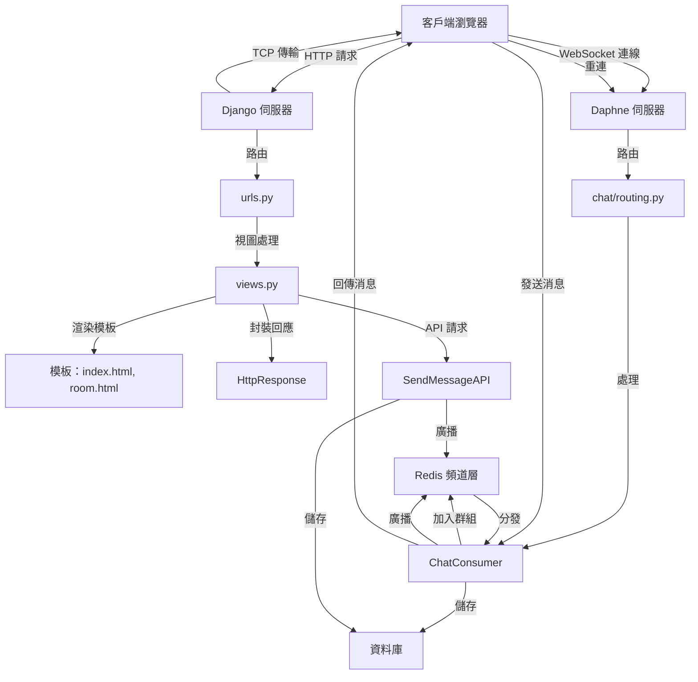

# 即時聊天應用程式

這是一個基於 **Django** 和 **Django Channels** 構建的即時聊天應用程式，支援多用戶聊天室並使用 WebSocket 傳遞消息。專案包含 REST API 和消息持久化功能，適合本地開發與測試。

## 功能
- 即時消息傳遞（WebSocket 支援）。
- 聊天記錄持久化（預設 SQLite）。
- REST API 供外部發送消息（需認證）。
- 簡單的前端介面（HTML/JavaScript）。
- 環境變數配置（使用 `python-decouple`）。

## 架構圖



**說明**：
- **HTTP 流程**：
  - 客戶端發送 HTTP 請求，`urls.py` 路由到 `views.py`，渲染 `index.html` 或 `room.html`，生成 `HttpResponse`，通過 TCP 傳回客戶端。
- **WebSocket 流程**：
  - 客戶端建立 WebSocket 連線，`chat/routing.py` 路由到 `ChatConsumer`，加入 `Redis 頻道層` 群組，處理消息並廣播，儲存至資料庫，最終回傳給客戶端。
- **REST API 流程**：
  - 外部 API 請求通過 `SendMessageAPI` 儲存消息並廣播到 `Redis 頻道層`，與 WebSocket 流程整合。
- **重連機制**：客戶端監聽 WebSocket 斷開，嘗試重新連線。

## 環境要求
- Python 3.10+
- Redis（運行在 `127.0.0.1:6379`）
- Git

## 安裝與運行

1. **克隆倉庫**：
   ```bash
   git clone https://github.com/BpsEason/realtime_chat_project.git
   cd realtime_chat_project
   ```

2. **建立虛擬環境**：
   ```bash
   python3 -m venv .venv
   source .venv/bin/activate  # Windows: .venv\Scripts\activate
   ```

3. **安裝依賴**：
   ```bash
   pip install -r requirements.txt
   ```

4. **啟動 Redis**：
   - Ubuntu/Debian：`sudo apt install redis-server`
   - macOS：`brew install redis && brew services start redis`
   - 檢查：`redis-cli ping`（應返回 `PONG`）

5. **配置環境變數**：
   建立 `.env` 檔案：
   ```ini
   SECRET_KEY=your-secure-key-here
   DEBUG=True
   ALLOWED_HOSTS=127.0.0.1,localhost
   REDIS_URL=redis://127.0.0.1:6379
   ```
   生成 `SECRET_KEY`：
   ```bash
   python -c 'from django.core.management.utils import get_random_secret_key; print(get_random_secret_key())'
   ```

6. **遷移資料庫**：
   ```bash
   python manage.py migrate
   ```

7. **建立超級用戶（可選）**：
   ```bash
   python manage.py createsuperuser
   ```

8. **啟動伺服器**：
   - 終端機 1（WebSocket）：
     ```bash
     daphne -b 0.0.0.0 -p 8000 realtime_chat_project.asgi:application
     ```
   - 終端機 2（HTTP）：
     ```bash
     python manage.py runserver 0.0.0.0:8001
     ```

9. **訪問應用程式**：
   - 打開：`http://127.0.0.1:8001/chat/`
   - WebSocket：`ws://127.0.0.1:8000/ws/chat/<room_name>/`

## 關鍵代碼片段

### 1. WebSocket Consumer (`chat/consumers.py`)
```python
class ChatConsumer(AsyncWebsocketConsumer):
    async def connect(self):
        # 獲取聊天室名稱並生成群組名稱
        self.room_name = self.scope['url_route']['kwargs']['room_name']
        self.room_group_name = f'chat_{self.room_name}'
        # 將連線加入 Redis 頻道層的群組
        await self.channel_layer.group_add(self.room_group_name, self.channel_name)
        # 獲取用戶資訊，匿名時使用預設名稱
        self.user = self.scope['user']
        username = self.user.username if self.user.is_authenticated else "未登入用戶"
        # 接受 WebSocket 連線
        await self.accept()

    async def receive(self, text_data):
        # 解析接收到的 JSON 數據
        text_data_json = json.loads(text_data)
        message = text_data_json['message']
        # 獲取發送者用戶名
        username = self.user.username if self.user.is_authenticated else "未登入用戶"
        current_timestamp = timezone.now()
        # 使用 sync_to_async 儲存消息到資料庫
        if self.user.is_authenticated:
            await sync_to_async(ChatMessage.objects.create)(
                room_name=self.room_name, sender=self.user, content=message, timestamp=current_timestamp
            )
        else:
            await sync_to_async(ChatMessage.objects.create)(
                room_name=self.room_name, content=message, timestamp=current_timestamp
            )
        # 廣播消息到 Redis 頻道層
        await self.channel_layer.group_send(
            self.room_group_name,
            {'type': 'chat_message', 'message': message, 'user': username, 'timestamp': current_timestamp.isoformat()}
        )

    async def chat_message(self, event):
        # 將接收到的消息發送回客戶端
        await self.send(text_data=json.dumps({
            'message': event['message'],
            'user': event['user'],
            'timestamp': event['timestamp']
        }))
```

### 2. REST API (`chat/views.py`)
```python
class SendMessageAPI(APIView):
    permission_classes = [IsAuthenticated]  # 限制僅認證用戶訪問
    def post(self, request, room_name):
        # 獲取請求中的消息內容
        message = request.data.get('message')
        # 驗證消息是否有效
        if not message or not message.strip():
            return Response({"error": "消息內容不可為空"}, status=400)
        current_timestamp = timezone.now()
        # 儲存消息到資料庫
        ChatMessage.objects.create(room_name=room_name, sender=request.user, content=message, timestamp=current_timestamp)
        # 獲取頻道層並廣播消息
        channel_layer = get_channel_layer()
        async_to_sync(channel_layer.group_send)(
            f'chat_{room_name}',
            {'type': 'chat_message', 'message': message, 'user': request.user.username, 'timestamp': current_timestamp.isoformat()}
        )
        return Response({"status": "成功"}, status=200)
```

### 3. 前端 WebSocket (`chat/templates/chat/room.html`)
```javascript
var wsUrl = 'ws://' + window.location.host + '/ws/chat/' + encodeURIComponent(roomName) + '/';
// 建立 WebSocket 連線
var webSocket = new WebSocket(wsUrl);
// 監聽接收到的消息並更新頁面
webSocket.onmessage = function(e) {
    var data = JSON.parse(e.data);
    appendMessage(data.user, data.message, data.timestamp);
};
// 監聽連線斷開並嘗試重連
webSocket.onclose = function(e) {
    console.log('連線斷開，重連中...');
    setTimeout(function() { new WebSocket(wsUrl); }, 1000);
};
webSocket.onerror = function(e) {
    console.log('發生錯誤，重連中...');
    setTimeout(function() { new WebSocket(wsUrl); }, 1000);
};
```

## 即時聊天消息傳遞流程 (Real-time Chat Message Flow)

### 客戶端進入聊天室
- 使用者在 `index.html` 輸入聊天室名稱，點擊「進入聊天室」後，導向 `room.html`（`http://127.0.0.1:8001/chat/<room_name>/`）。
- `room.html` 載入後，內嵌 JavaScript 建立 WebSocket 連線（`ws://127.0.0.1:8000/ws/chat/<room_name>/`）。

### WebSocket 連線建立 (Consumer connect)
- Daphne 接收 WebSocket 請求，根據 `asgi.py` 路由轉發到 `chat/routing.py`。
- `ChatConsumer` 的 `connect` 方法被呼叫，獲取 `room_name`，並透過 `self.channel_layer.group_add()` 加入 Redis 頻道層的群組（例如 `chat_<room_name>`）。

### 消息發送 (從客戶端)
- 使用者在 `room.html` 輸入消息並點擊「發送」，前端 JavaScript 透過 WebSocket 將消息發送到 `ChatConsumer` 的 `receive` 方法。

### 消息處理與廣播 (Consumer receive)
- `receive` 解析 JSON 消息，儲存至資料庫（使用 `sync_to_async` 處理 ORM），並透過 `self.channel_layer.group_send()` 廣播到 Redis 頻道層。

### 消息接收與顯示 (Consumer chat_message & 客戶端)
- Redis 頻道層分發消息，所有 `ChatConsumer` 實例接收，觸發 `chat_message` 方法。
- 消息透過 WebSocket 回傳至客戶端，`room.html` 的 `webSocket.onmessage` 解析並顯示在 `#chat-log`。

## REST API 消息發送流程 (REST API Message Sending Flow)

### API 請求
- 外部系統向 `http://127.0.0.1:8001/chat/api/send_message/<room_name>/` 發送帶認證的 HTTP POST 請求。

### API 處理 (SendMessageAPI)
- Django WSGI 伺服器路由到 `SendMessageAPI`，驗證請求，儲存消息至資料庫。
- 使用 `async_to_sync(channel_layer.group_send())` 廣播至 Redis 頻道層。

### 消息廣播與顯示
- 與 WebSocket 流程相同，消息透過 Redis 分發並顯示在所有連線客戶端。

## 錯誤處理與重連機制
- `room.html` 的 JavaScript 監聽 `onclose` 和 `onerror` 事件，於斷線或錯誤時顯示狀態並延時 1 秒重連。

## 常見問題 (FAQ)

### 1. 為什麼選擇 Django Channels 而不是傳統 HTTP 請求？
- **原因**：傳統 HTTP 需輪詢，效率低。Django Channels 使用 WebSocket 提供即時推送。

### 2. Redis 在專案中扮演什麼角色？
- **角色**：Redis 作為頻道層，協調消息廣播，確保多用戶同步。

### 3. 如何處理 WebSocket 連線的認證與授權？
- **方式**：`AuthMiddlewareStack` 附加會話資訊，`ChatConsumer` 檢查登入狀態。

### 4. `sync_to_async` 和 `async_to_sync` 的作用？
- **作用**：
  - `sync_to_async`：異步環境執行同步 ORM。
  - `async_to_sync`：同步環境呼叫異步操作。

### 5. SendMessageAPI 的用途與 WebSocket 區別？
- **用途**：外部系統發送消息。
- **區別**：REST API 為單次請求，WebSocket 為持久連線。

### 6. room.html 中 WebSocket 重連機制？
- **實現**：`onclose`/`onerror` 後 1 秒重連，建議生產環境用指數退避。

### 7. 如何部署到生產環境？
- **步驟**：
  - **數據庫**：PostgreSQL 或 MySQL。
  - **Web 伺服器**：Nginx/Apache 與 SSL。
  - **ASGI 伺服器**：`gunicorn`。
  - **環境變數**：`DEBUG=False`。
  - **日誌**：配置監控。
  - **SSL/TLS**：啟用加密。
  - **持久化**：確保數據持久。
  - **Docker（可選）**：用 Docker Compose。

### 8. Django 伺服器渲染模板後如何回到客戶端？
- **過程**：HTTP 請求路由至 `views.py`，`render` 處理模板，生成 `HttpResponse`，通過 TCP 傳回。

## 貢獻
1. Fork 倉庫。
2. 建立分支：`git checkout -b feature/name`。
3. 提交：`git commit -m "描述"`。
4. 推送：`git push origin feature/name`。
5. 提交 PR。

## 許可證
採用 MIT 許可證（建議添加 `LICENSE` 檔案）。

## 倉庫連結
[https://github.com/BpsEason/realtime_chat_project](https://github.com/BpsEason/realtime_chat_project)
