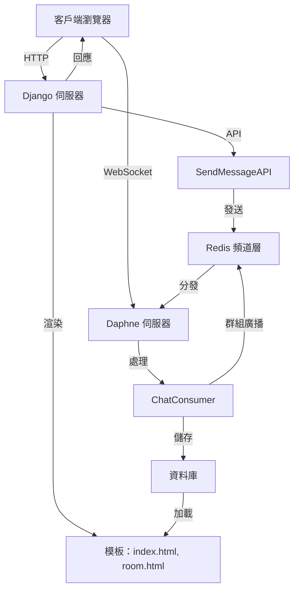

# 即時聊天應用程式

這是一個基於 **Django** 和 **Django Channels** 構建的即時聊天應用程式，支援多個聊天室並使用 WebSocket 傳遞消息。專案包含 REST API 和消息持久化功能，適合本地開發與測試。

## 功能
- 即時消息傳遞（WebSocket 支援）。
- 聊天記錄持久化（預設 SQLite）。
- REST API 供外部發送消息（需認證）。
- 簡單的前端介面（HTML/JavaScript）。
- 環境變數配置（使用 `python-decouple`）。

## 架構圖



**說明**：
- **客戶端瀏覽器**：通過 `index.html` 選擇聊天室，`room.html` 進行聊天。
- **Django 伺服器**：處理 HTTP 請求並渲染頁面。
- **Daphne 伺服器**：管理 WebSocket 連線，依賴 Redis 頻道層實現群組廣播。
- **ChatConsumer**：處理 WebSocket 消息並觸發廣播。
- **Redis 頻道層**：負責分發消息到同一聊天室的全部客戶端，確保多用戶同步。
- **資料庫**：儲存聊天記錄。
- **SendMessageAPI**：提供 REST API 功能。

## 環境要求
- Python 3.10+
- Redis（運行在 `127.0.0.1:6379`）
- Git

## 安裝與運行

1. **克隆倉庫**：
   ```bash
   git clone https://github.com/BpsEason/realtime_chat_django.git
   cd realtime_chat_project
   ```

2. **建立虛擬環境**：
   ```bash
   python3 -m venv .venv
   source .venv/bin/activate  # Windows: .venv\Scripts\activate
   ```

3. **安裝依賴**：
   ```bash
   pip install -r requirements.txt
   ```

4. **啟動 Redis**：
   - Ubuntu/Debian：`sudo apt install redis-server`
   - macOS：`brew install redis && brew services start redis`
   - 檢查：`redis-cli ping`（應返回 `PONG`）

5. **配置環境變數**：
   建立 `.env` 檔案：
   ```ini
   SECRET_KEY=your-secure-key-here
   DEBUG=True
   ALLOWED_HOSTS=127.0.0.1,localhost
   REDIS_URL=redis://127.0.0.1:6379
   ```
   生成 `SECRET_KEY`：
   ```bash
   python -c 'from django.core.management.utils import get_random_secret_key; print(get_random_secret_key())'
   ```

6. **遷移資料庫**：
   ```bash
   python manage.py migrate
   ```

7. **建立超級用戶（可選）**：
   ```bash
   python manage.py createsuperuser
   ```

8. **啟動伺服器**：
   - 終端機 1（WebSocket）：
     ```bash
     daphne -b 0.0.0.0 -p 8000 realtime_chat_project.asgi:application
     ```
   - 終端機 2（HTTP）：
     ```bash
     python manage.py runserver 0.0.0.0:8001
     ```

9. **訪問應用程式**：
   - 打開：`http://127.0.0.1:8001/chat/`
   - WebSocket：`ws://127.0.0.1:8000/ws/chat/<room_name>/`

## 關鍵代碼片段

### 1. WebSocket Consumer (`chat/consumers.py`)
```python
class ChatConsumer(AsyncWebsocketConsumer):
    async def connect(self):
        # 獲取聊天室名稱並建立群組名稱
        self.room_name = self.scope['url_route']['kwargs']['room_name']
        self.room_group_name = f'chat_{self.room_name}'
        # 將當前連線加入聊天室群組
        await self.channel_layer.group_add(self.room_group_name, self.channel_name)
        # 獲取當前用戶，匿名時設為預設名稱
        self.user = self.scope['user']
        username = self.user.username if self.user.is_authenticated else "未登入用戶"
        # 接受 WebSocket 連線
        await self.accept()

    async def receive(self, text_data):
        # 解析接收到的 JSON 數據
        text_data_json = json.loads(text_data)
        message = text_data_json['message']
        # 獲取發送者用戶名
        username = self.user.username if self.user.is_authenticated else "未登入用戶"
        current_timestamp = timezone.now()
        # 儲存消息到資料庫，區分認證與匿名用戶
        if self.user.is_authenticated:
            ChatMessage.objects.create(room_name=self.room_name, sender=self.user, content=message, timestamp=current_timestamp)
        else:
            ChatMessage.objects.create(room_name=self.room_name, content=message, timestamp=current_timestamp)
        # 將消息廣播到聊天室群組
        await self.channel_layer.group_send(
            self.room_group_name,
            {'type': 'chat_message', 'message': message, 'user': username, 'timestamp': current_timestamp.isoformat()}
        )
```

### 2. REST API (`chat/views.py`)
```python
class SendMessageAPI(APIView):
    permission_classes = [IsAuthenticated]  # 限制僅認證用戶訪問
    def post(self, request, room_name):
        # 獲取請求中的消息內容
        message = request.data.get('message')
        # 檢查消息是否有效
        if not message or not message.strip():
            return Response({"error": "消息內容不可為空"}, status=400)
        current_timestamp = timezone.now()
        # 儲存消息到資料庫
        ChatMessage.objects.create(room_name=room_name, sender=request.user, content=message, timestamp=current_timestamp)
        # 獲取頻道層並同步發送消息到 WebSocket
        channel_layer = get_channel_layer()
        async_to_sync(channel_layer.group_send)(
            f'chat_{room_name}',
            {'type': 'chat_message', 'message': message, 'user': request.user.username, 'timestamp': current_timestamp.isoformat()}
        )
        return Response({"status": "成功"}, status=200)
```

### 3. 前端 WebSocket (`chat/templates/chat/room.html`)
```javascript
var wsUrl = 'ws://' + window.location.host + '/ws/chat/' + encodeURIComponent(roomName) + '/';
// 建立 WebSocket 連線
var webSocket = new WebSocket(wsUrl);
// 監聽接收到的消息並顯示
webSocket.onmessage = function(e) {
    var data = JSON.parse(e.data);
    appendMessage(data.user, data.message, data.timestamp);
};
// 監聽連線斷開並嘗試重連
webSocket.onclose = function(e) {
    setTimeout(function() { new WebSocket(wsUrl); }, 1000);
};
```

## 常見問題 (FAQ)

### 1. 為什麼選擇 Django Channels 而不是傳統 HTTP 請求？
- **原因**：傳統 HTTP 是無狀態的請求/回應模型，需不斷輪詢伺服器，效率低且延遲高。Django Channels 使用 WebSocket 提供持久雙向連線，伺服器可即時推送消息，減少網路負擔並提升即時性。

### 2. Redis 在專案中扮演什麼角色？
- **角色**：Redis 作為 Django Channels 的頻道層，負責不同 Daphne 實例間的訊息通訊與廣播。當用戶發送消息，Redis 將其分發給所有訂閱同一聊天室頻道的消費者，確保多用戶同步。其高速性能是訊息中介的關鍵。

### 3. 如何處理 WebSocket 連線的認證與授權？
- **方式**：使用 `channels.auth.AuthMiddlewareStack` 將 Django 會話資訊附加到 `scope['user']`，讓 `ChatConsumer` 檢查登入狀態。僅認證用戶可發送消息，可在 `connect` 或 `receive` 中添加額外權限邏輯。

### 4. `sync_to_async` 和 `async_to_sync` 的作用？
- **作用**：
  - `sync_to_async`：在異步環境（如 `ChatConsumer`）中執行同步操作（如 ORM 的 `ChatMessage.objects.create`），避免阻塞事件迴圈。
  - `async_to_sync`：在同步環境（如 REST API）中呼叫異步操作（如 `group_send`），橋接同步與異步。

### 5. SendMessageAPI 的用途與 WebSocket 區別？
- **用途**：SendMessageAPI 為 RESTful 端點，允許外部系統（如 Webhook 或排程任務）透過 HTTP POST 發送消息到聊天室。
- **區別**：
  - 連線：REST API 為單次請求/回應，WebSocket 為持久雙向連線。
  - 即時性：WebSocket 提供即時推送，REST API 需依賴其他機制接收消息。
  - 用途：WebSocket 適合客戶端即時互動，REST API 適用於異步整合。

### 6. room.html 中 WebSocket 重連機制？
- **實現**：`webSocket.onclose` 觸發時，設定 1 秒延遲後重連。生產環境建議採用指數退避策略並設定最大重連次數，減少資源消耗。

### 7. 如何部署到生產環境？
- **步驟**：
  - **數據庫**：替換為 PostgreSQL 或 MySQL。
  - **Web 伺服器**：使用 Nginx/Apache 處理靜態文件、負載均衡和 SSL。
  - **ASGI 伺服器**：運行 `gunicorn --worker-class=uvicorn.workers.UvicornWorker`。
  - **環境變數**：設定 `DEBUG=False`，安全管理 `SECRET_KEY`。
  - **日誌**：配置監控日誌（如 ELK stack）。
  - **SSL/TLS**：啟用加密保護連線。
  - **持久化**：確保 Redis 和資料庫數據持久化。
  - **Docker（可選）**：使用 Docker Compose 協調服務。

## 貢獻
1. Fork 倉庫。
2. 建立分支：`git checkout -b feature/name`。
3. 提交：`git commit -m "描述"`。
4. 推送：`git push origin feature/name`。
5. 提交 PR。

## 許可證
採用 MIT 許可證（建議添加 `LICENSE` 檔案）。

## 倉庫連結
[https://github.com/BpsEason/realtime_chat_project](https://github.com/BpsEason/realtime_chat_project)
